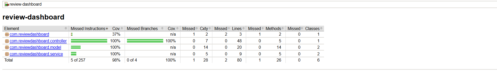

# Review Dashboard

This is the official repository for the Review Dashboard project.

## Project Overview

A Spring Boot Client application designed to manage product reviews and integrate with external services for company and product information. It provides RESTful APIs for adding reviews and retrieving average ratings for products and companies.

## Key Features

### 1. **REST API for Review Management**
- **Add Reviews**: Endpoint to submit new reviews for products.
- **Retrieve Average Ratings**: Endpoints to get average ratings for specific products and companies.

### 2. **Service Integration**
- **Feign Clients**: Utilizes Spring Cloud OpenFeign to communicate with external `Auth`, `Review`, and `Company` microservices.
- **Service Layer**: Abstracts external service calls and provides a clean interface for the controller.

### 3. **Spring Boot Application**
- **Rapid Development**: Built with Spring Boot for quick setup and deployment.
- **Dependency Injection**: Manages component dependencies using Spring's IoC container.

### 4. **Robust Testing**
- **Unit Tests**: Comprehensive unit tests for controllers, services, and DTOs using JUnit 5 and Mockito.
- **Integration Tests**: Web layer integration tests using `@WebMvcTest` to verify controller behavior.
- **Test Coverage**: Integrated JaCoCo for measuring code coverage.

## What the Client Does

The Review Dashboard is a Spring Boot application that acts as a client-side facade for a larger microservices ecosystem. It provides a centralized API to interact with separate `review` and `company` services, handling tasks like submitting reviews and fetching aggregated data.

This client is designed to be a lightweight intermediary, abstracting the complexity of direct service-to-service communication from the end-user or frontend application.

## How to Build and Run the Client

### Prerequisites

-   Java 17 or higher
-   Maven 3.6 or higher
-   Docker (for running the containerized version)

### Building the Application

1.  **Clone the repository**:
    ```bash
    git clone <repository-url>
    cd ReviewDashboard
    ```

2.  **Compile and package the application**:
    This command will run the tests, check code style, and package the application into an executable JAR file in the `target/` directory.
    ```bash
    mvn clean package
    ```

### Running the Application

You can run the application either directly with Java or as a Docker container.

**Option 1: Running with Java**

```bash
java -jar target/review-dashboard-1.0.0.jar
```

**Option 2: Running with Docker**

First, build the Docker image using the provided `Dockerfile`:

```bash
docker build -t review-dashboard .
```

Then, run the container:

```bash
docker run -p 8081:8081 review-dashboard
```

The application will be accessible at `http://localhost:8081`.

## How to Connect Client Instances to the Service

The Review Dashboard client connects to external `review` and `company` microservices. The URLs for these services are configured in the `src/main/resources/application.yaml` file.

To connect your client instance, you must override the default URLs with the actual addresses of your running services.

### Configuration

The Feign client URLs are defined by the following properties:

-   `review.client.url`
-   `company.client.url`

You can set these properties when running the application.

**Example:**

If your `review-service` is running at `http://localhost:8082` and your `company-service` is at `http://localhost:8083`, you can run the client with the following command:

```bash
java -jar target/review-dashboard-1.0.0.jar \
     --review.client.url=http://localhost:8082 \
     --company.client.url=http://localhost:8083
```

This command-line argument approach allows you to dynamically connect your client to different environments (e.g., local, staging, production) without changing the packaged code.


## Project Structure

```
ReviewDashboard/
├── src/
│   ├── main/
│   │   ├── java/com/reviewdashboard/
│   │   │   ├── ReviewDashBoardApplication.java # Main Spring Boot entry point
│   │   │   ├── client/                       # Feign clients for external services
│   │   │   │   ├── AuthClient.java           # Client for Auth Service (create users)
│   │   │   │   ├── CompanyClient.java        # Client for Company Service
│   │   │   │   └── ProductClient.java        # Client for Product Service
│   │   │   ├── controller/                   # REST API controllers
│   │   │   │   ├── AuthController.java
│   │   │   │   └── ReviewClientController.java
│   │   │   ├── model/                        # Data Transfer Objects (DTOs)
│   │   │   │   ├── CreateUserRequest.java
│   │   │   │   ├── ReviewDto.java
│   │   │   │   └── UserDto.java
│   │   │   └── service/                      # Business logic services
│   │   │       ├── AuthService.java
│   │   │       ├── CompanyService.java
│   │   │       └── ReviewService.java
│   │   └── resources/
│   │       └── application.properties        # Spring Boot configuration
│   └── test/
│       ├── java/com/reviewdashboard/
│       │   ├── ReviewDashBoardApplicationTest.java
│       │   ├── controller/
│       │   │   ├── ReviewClientControllerTest.java           # Unit tests
│       │   │   └── ReviewClientControllerIntegrationTest.java  # Integration tests
│       │   ├── model/
│       │   │   ├── ReviewDtoTest.java
│       │   │   └── UserDtoTest.java
│       │   └── service/
│       │       ├── CompanyServiceTest.java
│       │       └── ReviewServiceTest.java
├── pom.xml                                   # Maven configuration
└── README.md                                 # Project documentation
```

## REST API Endpoints

BASE URL: `http://localhost:8080`
CLOUD URL: `https://review-dashboard-client-321275563168.us-central1.run.app`

Review endpoints are prefixed with `/review`. User creation is under `/auth`.

Important header requirement
- All review endpoints require the header: `X-User-Id: <yourUserId>`.
- If the header is missing, the API returns `400 Bad Request` with message: "Please provide a userID in a header".
- If the user ID does not exist upstream, the API returns `401 Unauthorized` with message: "Your user ID does not exist. Please create a new user." Use the Auth endpoint below to create one.

- `POST /review/product/{productId}`
  - **Description**: Submits a new review for a given product.
  - **Request Body**: `ReviewDto` (JSON)
  - **Headers (required)**: `X-User-Id: <yourUserId>`
  - **Status Codes**:
    - `201 Created` — Review created; returns `ReviewDto`.
    - `400 Bad Request` — Missing `X-User-Id` header, invalid rating (<1 or >5), or invalid payload.
    - `401 Unauthorized` — Unknown `X-User-Id`.
    - `500 Internal Server Error` — Upstream/service error.
  - **Example**:
  - `POST http://localhost:8080/review/product/product123
    Content-Type: application/json`
    ```json

    {
      "comment": "This product is amazing!",
      "rating": 5,
      "user": {
        "username": "testUser"
      }
    }
    ```

- `GET /review/product/{productId}/average-rating`
  - **Description**: Retrieves the average rating for a specific product.
  - **Headers (required)**: `X-User-Id: <yourUserId>`
  - **Status Codes**:
    - `200 OK` — Returns `Double` average rating.
    - `400 Bad Request` — Missing `X-User-Id` header or invalid request.
    - `401 Unauthorized` — Unknown `X-User-Id`.
    - `404 Not Found` — No reviews found for the product.
    - `500 Internal Server Error` — Upstream/service error.
  - **Example**: `GET http://localhost:8080/review/product/product123/average-rating`

- `GET /review/company/{companyId}/average-rating`
  - **Description**: Retrieves the average rating for a specific company.
  - **Headers (required)**: `X-User-Id: <yourUserId>`
  - **Status Codes**:
    - `200 OK` — Returns `Double` average rating.
    - `400 Bad Request` — Missing `X-User-Id` header or invalid request.
    - `401 Unauthorized` — Unknown `X-User-Id`.
    - `404 Not Found` — No reviews found for the company.
    - `500 Internal Server Error` — Upstream/service error.
  - **Example**: `GET http://localhost:8080/review/company/company456/average-rating`

### Auth

- `POST /auth/users`
  - **Description**: Creates a new user ID in the Auth service.
  - **Request Body**:
    ```json
    { "userId": "user123" }
    ```
  - **Status Codes**:
    - `201 Created` — Body: `"User created"`.
    - `400 Bad Request` — Missing/blank `userId` or invalid `userId` upstream.
    - `409 Conflict` — "This user ID is already taken. Please choose another."
    - `500 Internal Server Error` — Upstream error or unexpected upstream status.

### Friendly Errors
- If `X-User-Id` is missing: `400` with "Please provide a userID in a header".
- If `X-User-Id` is unknown (upstream 401): `401` with "Your user ID does not exist. Please create a new user."

## Configuration

Set external service base URLs in `application.properties`:

```
company.client.url=https://.../api/companies
product.client.url=https://.../api/products
auth.client.url=https://.../api/auth
```

## Testing on GCP

When the application is deployed to Google Cloud Run, you can test the endpoints using the GCP URL:

**Base URL**: `https://review-dashboard-client-321275563168.us-central1.run.app`

### Example GCP Endpoints:

- **Get Product Average Rating**:
  ```
  GET https://review-dashboard-client-321275563168.us-central1.run.app/review/product/{productId}/average-rating
  ```

- **Get Company Average Rating**:
  ```
  GET https://review-dashboard-client-321275563168.us-central1.run.app/review/company/{companyId}/average-rating
  ```

- **Submit a Review**:
  ```
  POST https://review-dashboard-client-321275563168.us-central1.run.app/review/product/{productId}
  Content-Type: application/json

  {
    "comment": "Great product!",
    "user": {
      "username": "testUser",
      "email": "jane@example.com"
    }
  }
  ```

**Note**: Replace `{productId}` and `{companyId}` with actual IDs from your database.

## Testing Requirements

### Run all tests:
```bash
mvn test
```

### Run with coverage:
```bash
mvn clean test jacoco:report
```
To see the JaCoCo report, open:
`target/site/jacoco/index.html`.

### Unit Tests Coverage:
- `ReviewDashBoardApplicationTest`: Verifies application context loading.
- `ReviewClientControllerTest`: Unit tests for controller logic and error handling.
- `ReviewClientControllerIntegrationTest`: Integration tests for the web layer, verifying request/response handling.
- `AuthControllerTest`: Unit tests for user creation and error handling.
- `AuthControllerIntegrationTest`: Integration tests for `/auth/users`.
- `CompanyServiceTest`: Tests logic related to company average ratings.
- `ReviewServiceTest`: Tests logic related to adding reviews and product average ratings.
- `UserDtoTest`: Verifies `UserDto` getters and setters.
- `ReviewDtoTest`: Verifies `ReviewDto` getters and setters.

- Coverage Report : 
- 

## AI Usage

- AI was used to generate initial code snippets, add getters/setters, refactor code, and create comprehensive unit tests.
- AI assisted in debugging dependency conflicts and providing solutions for build issues.
- AI helped in generating Javadoc comments for better code documentation.

## Authors
- Development Team: [Manav Munjal, Sreenivas Karthik Bandi, Song Li and Sindhu Krishnamurthy]

---
---